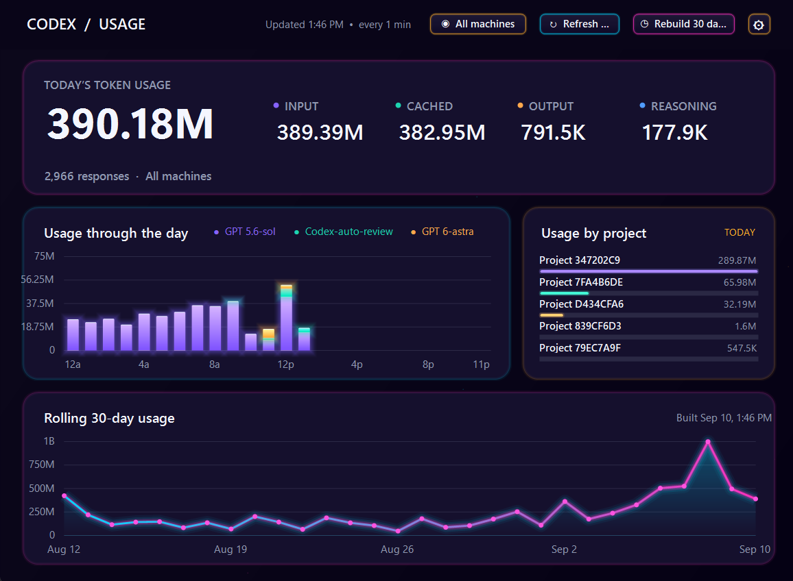

# Codex Usage



Codex Usage is a small desktop dashboard that makes Codex activity easier to understand. It turns the usage records already on your computer into clear daily and historical views. There are native versions for Windows and macOS, and your raw conversations stay on the machine where they happened.

Version 1.2 can also bring several computers together on your own local network. You can look at this computer, all computers, or one named computer without sending raw logs to the receiver.

The Windows client uses .NET and Windows Forms. A native SwiftUI client for macOS is available in [macOS](macOS/README.md).

## What it shows

- Today's total token usage, split into input, cached input, output, and reasoning tokens
- Hourly usage grouped by model
- Usage grouped by project
- An interactive rolling 30-day history
- Reasoning-effort breakdowns in the 30-day chart tooltips (separate from reasoning-token counts; hourly charts stay model-only)
- Historical hourly and project breakdowns
- Automatic refresh, with a configurable interval
- Optional encrypted, aggregate-only reporting across machines on the same LAN
- A single view selector for switching every graph between this computer, all computers, or another computer
- Stable private project IDs, with optional project names when you choose to share them
- Several built-in visual themes

Hover over the charts for more detail. Select a day in the 30-day chart to inspect it, and use **Rebuild 30 days** when you want to rescan the local history immediately.

## New in 1.2.1

- Performance fixes for Windows and macOS: cached chart aggregates avoid repeated usage-point scans during painting and interaction.
- macOS skips redundant hover-state updates, keeping pointer-driven UI changes responsive.
- Cached data refreshes when usage changes; token totals, chart scaling, and reasoning-effort detail are preserved.

## New in 1.2.0

- Daily-history tooltips show logged reasoning effort, such as Light, Medium, and High, on Windows and macOS. Current and older supported log fields are parsed; records without a usable effort value show **Unknown**.
- Effort travels with encrypted LAN aggregates and is preserved in combined-machine history. Older clients remain compatible. Use **Settings → Network → Force full upload** on each updated client to refresh its last 30 days; rebuilding cannot recover effort absent from the original logs.
- Hourly tooltips include per-model totals, with improved positioning and bottom padding on Windows.
- Windows rendering now skips minimized and zero-sized surfaces, fixing the intermittent minimize-time drawing errors.
- macOS fixes improve chart selection and snapshot bars, stabilize credential storage for ad-hoc builds, reduce repeated Keychain prompts, and clarify network errors.

## Snapshot export

The dashboard can periodically export its current view as a PNG. This is useful for a personal dashboard, a synced folder, or another display that watches a single image file.

From **Settings → Snapshot Export**, you can:

- Enable or disable capture
- Choose a local or synced destination folder
- Capture every 5, 15, 30, or 60 minutes
- Hide project names for privacy

The exporter atomically replaces `codex-usage-latest.png`; it does not accumulate an archive of old images. Capture preferences persist across application restarts.

No upload service or webhook is included. If the selected folder happens to be synchronized by another application, that synchronization remains entirely under the user's control.

## Data and privacy

Codex Usage currently reads session data from the signed-in user's standard Codex session directory:

```text
%USERPROFILE%\.codex\sessions
```

The session directory is configurable from **Settings → Codex Data → Choose session folder**. Its initial value is derived at runtime from the current user's operating-system home directory, so the application does not contain a hard-coded username or machine-specific path. The selected location persists across application restarts.

It does not modify those logs. Unless you explicitly enable LAN reporting, it does not send usage data anywhere. Dashboard settings and the derived 30-day cache are stored under:

```text
%LOCALAPPDATA%\Codex Usage
```

Project names are derived from the working directories recorded in the session logs. They remain local unless you deliberately place an exported snapshot in a shared location or choose **Project names** for LAN reporting. Snapshot export can replace names with generic labels. LAN reporting defaults to stable anonymous project IDs and can instead omit the project breakdown entirely. If you later choose to share project names, the client sends the name alongside its stable private ID so matching anonymous history can be labelled consistently.

LAN reporting transmits only hourly token counts grouped by model, reasoning effort, and, depending on your privacy setting, project. Raw Codex logs, prompts, responses, filenames, and paths remain on the machine where they were created. The receiver has no endpoint for raw-log upload. See [LAN reporting](docs/lan-reporting.md) for setup and security details.

## LAN reporting

One machine runs the receiver and each dashboard reports its own derived aggregates to it. The receiver defaults to loopback-only access, so LAN access must be deliberately enabled in its generated settings.

Initialize and configure the receiver:

```powershell
dotnet run --project .\src\CodexUsage.Receiver -- --init
dotnet run --project .\src\CodexUsage.Receiver -- --add-client <client-id> "<machine name>"
dotnet run --project .\src\CodexUsage.Receiver
```

The client ID is shown in **Settings → Network**. The add-client command asks for a shared passphrase without displaying it. Enter the same passphrase in that machine's dashboard, set the receiver's `http://host:port` address, test the encrypted exchange, and enable reporting.

The receiver writes its settings and SQLite database under `%LOCALAPPDATA%\Codex Usage Receiver`. Set `CODEX_USAGE_RECEIVER_DATA` to use a different data directory, which is useful for service accounts or isolated testing. Edit `receiver-settings.json` to choose the listening address and explicit allowed CIDR ranges before starting it on the LAN.

On macOS 14 or later, **Settings → Receiver Host** provides the same setup without a terminal. It hosts the existing Kestrel receiver and requires the .NET 10 ASP.NET Core runtime. The page configures the listener and CIDR allowlist, starts and stops the process, reports health, manages local clients, and rotates selected client credentials. Release builds bundle the framework-dependent receiver payload; they do not bundle the .NET runtime.

## Windows and Mac

The Windows and macOS apps share the same goal and the same network format, while still feeling at home on their respective platforms. Either one can report aggregate usage to the receiver, and macOS can host that receiver when .NET 10 is installed. The receiver can then show combined totals and per-machine graphs without collecting prompts, responses, raw logs, filenames, or working-directory paths.

The Linux client is the missing member of the family. If you would like to port it, you are warmly invited—the protocol, receiver, and existing clients are all here to build from. Do it because you can.

## Limitations

- Codex Usage reports activity recorded in local Codex session logs. With network sync enabled it can include other enrolled computers, but not cloud-only sessions or other ChatGPT surfaces.
- Historical accuracy depends on the local session logs still being present.
- Codex log formats are not a public compatibility contract and may change; unsupported record formats should be reported as issues.
- Token totals represent logged token activity and should not be treated as authoritative billing or plan-quota calculations.

## Windows requirements

- Windows 10 or later
- A compatible .NET Desktop Runtime for framework-dependent builds
- Local Codex session logs

## Run from source

Install the .NET SDK used by the project, then run:

```powershell
dotnet run --project .\CodexUsageDashboard.csproj
```

To create a release build:

```powershell
dotnet publish -c Release -o .\dist --self-contained false
```

Launch `Codex Usage.exe` from the resulting `dist` directory.

## macOS client

The native macOS client includes local token totals, selectable 30-day history, hourly model and project breakdowns, Keychain-backed protocol v1 LAN reporting, and private PNG snapshots. Build it with `./macOS/build-app.sh`; see [macOS setup and verification](macOS/README.md) and [compatibility notes](docs/macos-implementation.md).

## Current status

Version 1.2.1 includes native Windows and macOS dashboards, performance improvements, interactive history with reasoning-effort detail, themes, snapshot export, and optional encrypted aggregate reporting across your local network.

Small utilities, made because we can.
